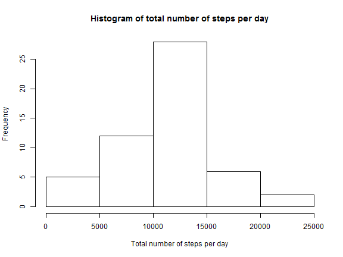
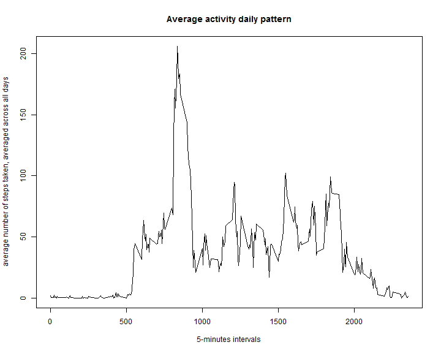
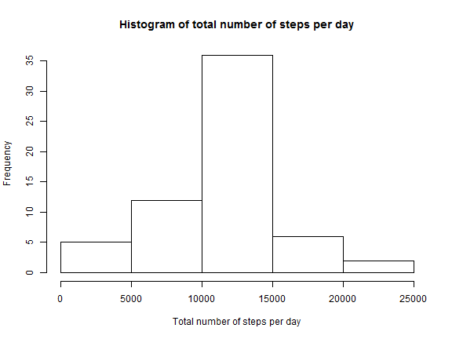
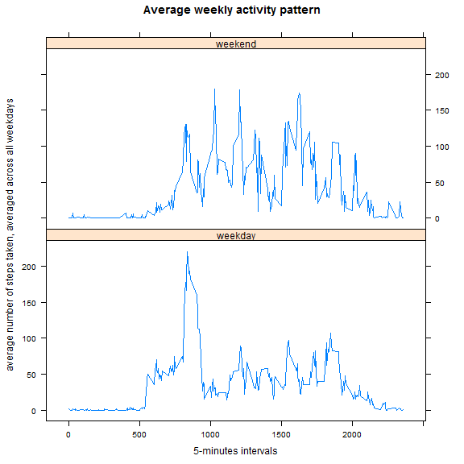

Reproducible Research Course Project 1  
====================================

In this assignment we want to study patterns of human activity via the data from a personal activity monitoring device. This device collects data at 5 minute intervals through out the day. The description of the data comes from the course project specificiation: *The data consists of two months of data from an anonymous individual collected during the months of October and November, 2012 and include the number of steps taken in 5 minute intervals each day*.

## Loading and preprocessing the data

First we read the data into R and convert the date variable from a factor variable to a Date variable type.


```r
activity <- read.csv("activity.csv")
activity$date <- as.Date(activity$date)
```

## What is the mean total number of steps taken per day?

We aggregate the activity dataset into a data frame stepsday that contains in the variable steps the total number of steps taken each day.


```r
stepsday = aggregate(steps ~ date, data=activity, sum)
```

We plot the histogram of the total number of steps taken per day.


```r
hist(stepsday$steps, xlab="Total number of steps per day", main="Histogram of total number of steps per day")
```

 

We calculate and report the mean and the median of the total number of steps taken per day.


```r
mean(stepsday$steps)
```

```
## [1] 10766.19
```

```r
median(stepsday$steps)
```

```
## [1] 10765
```

## What is the average daily activity pattern?

We again aggregate the activity data into a data frame daily that contains in the variable steps the average number of steps taken, average across all days. 


```r
daily = aggregate(steps~ interval, data=activity, mean)
```

Then we make a time series plot of the 5-minute interval in the x-axis and the average number of steps taken, average across all days in the y-axis.


```r
plot(daily$interval, daily$steps,type="l", xlab="5-minutes intervals", 
     ylab="average number of steps taken, averaged across all days", main="Average activity daily pattern")
```

 
We calculate and report the 5-minutes interval which, on average across all the days in the dataset, contains the maximum nuber of steps.


```r
daily$interval[which.max(daily$steps)]
```

```
## [1] 835
```

## Imputing missing values

In the previous steps, we have observed that there are a number of days/intervals where there are missing values. The presence of this missing data could bias our analysis, so in this step we will impute those missing values.

We first calculate and report the total number of missing values in the dataset.


```r
sum(is.na(activity))
```

```
## [1] 2304
```

In our effort to impute those missing values, we merge the original dataset activitiy with the daily dataset, we previously created when trying to compute the daily activity pattern, by the variable interval creating a new data frame called imputed. The imputed data frame has in the steps.x variable the original step variable which contains missing values. We select the values of steps.x that contain mising values and replace then with the mean for that 5-minute interval from the steps.y variable.  


```r
imputed = merge(activity, daily, by.x="interval", by.y="interval")
imputed$steps.x[is.na(imputed$steps.x)]= imputed$steps.y[is.na(imputed$steps.x)]
```

We create a new dataset activityNew from the imputed dataset that is equal to the original dataset but with the missing data filled in.


```r
activityNew=imputed[c("interval", "steps.x", "date")]
names(activityNew) = c("interval", "steps", "date")
```

We then aggregate the activityNew dataset into a data frame stepsday2 that contains in the variable steps the total number of steps taken each day.


```r
stepsday2 = aggregate(steps ~ date, data=activityNew, sum)
```

We plot the histogram of the total number of steps taken per day.  


```r
hist(stepsday2$steps, xlab="Total number of steps per day", main="Histogram of total number of steps per day")
```

 


We calculate and report the mean and the median of the total number of steps taken per day with the missing values being imputed with the mean for the 5-interval values.


```r
mean(stepsday2$steps)
```

```
## [1] 10766.19
```

```r
median(stepsday2$steps)
```

```
## [1] 10766.19
```

We can see that this values are much higher than those of the original dataset. The value for mean changes from 1.076619 &times; 10<sup>4</sup> in the imputed dataset to 1.076619 &times; 10<sup>4</sup> in the original dataset and the median changes from 1.076619 &times; 10<sup>4</sup> in the imputed dataset to 1.0765 &times; 10<sup>4</sup> in the original dataset.

## Are there differences in activity patterns between weekdays and weekends?

To answer this question we first create a new factor variable in the activityNew dataset with two levels *weekday* and *weekend* indicating wheter a given date is a weekday or weekend day.


```r
activityNew$dates=ifelse(weekdays(activityNew$date) %in% c('sábado','domingo'), "weekend", "weekday")
```

We again aggregate the activity data into a data frame weekdays that contains in the variable steps the average number of steps taken, average across all weekday days or weekend days. 


```r
weekdays = aggregate(steps~ interval + dates, data=activityNew, mean)
```

Then we load the required package and make a time series plot of the 5-minute interval in the x-axis and the average number of steps taken, average across all weekday days or weekday days in the y-axis.


```r
library(lattice)
xyplot(weekdays$steps~ weekdays$interval|weekdays$dates,type="l", layout = c(1, 2), 
       xlab="5-minutes intervals", ylab="average number of steps taken, averaged across all weekdays", 
       main="Average weekly activity pattern")
```

 
